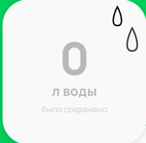
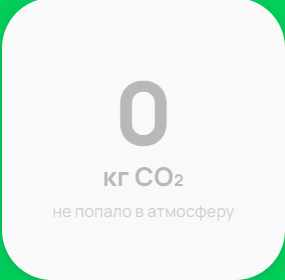

# Тест-кейсы для тестирования счётчиков десктопной версии.

---

**ID**: 1

**Заголовок**: Проверить расположение счетчиков

**Шаги**: 
1. Открыть страницу [подсчета экологического вклада](https://www.avito.ru/avito-care/eco-impact)
2. Прокрутить страницу вниз до раздела "Ваш экологический вклад"

**Ожидаемый результат**: 

---

**ID**: 2

**Заголовок**: Проверить заголовок "Ваш экологический вклад"

**Шаги**: 
1. Открыть страницу [подсчета экологического вклада](https://www.avito.ru/avito-care/eco-impact)
2. Прокрутить страницу вниз до раздела "Ваш экологический вклад"

**Ожидаемый результат**: 

---

**ID**: 3

**Заголовок**: Проверить описание заголовка "Ваш экологический вклад"

**Шаги**: 
1. Открыть страницу [подсчета экологического вклада](https://www.avito.ru/avito-care/eco-impact)
2. Прокрутить страницу вниз до раздела "Ваш экологический вклад"

**Ожидаемый результат**: 

---

**ID**: 4

**Заголовок**: Проверить кнопку Авторизоваться

**Шаги**: 
1. Открыть страницу [подсчета экологического вклада](https://www.avito.ru/avito-care/eco-impact)
2. Прокрутить страницу вниз до раздела "Ваш экологический вклад"

**Ожидаемый результат**: 

---

**ID**: 5

**Заголовок**: Проверить счетчик сохранённого объёма воды для неавторизованного пользователя

**Предусловие**: Пользователь не авторизован

**Шаги**: 
1. Открыть страницу [подсчета экологического вклада](https://www.avito.ru/avito-care/eco-impact)
2. Прокрутить страницу вниз до раздела "Ваш экологический вклад"

**Ожидаемый результат**: 

---

**ID**: 6

**Заголовок**: Проверить счетчик предотвращённого объёма выброса CO2 для неавторизованного пользователя

**Предусловие**: Пользователь не авторизован

**Шаги**: 
1. Открыть страницу [подсчета экологического вклада](https://www.avito.ru/avito-care/eco-impact)
2. Прокрутить страницу вниз до раздела "Ваш экологический вклад"

**Ожидаемый результат**: 

---

**ID**: 7

**Заголовок**: Проверить счетчик сэкономленной электроэнергии для неавторизованного пользователя

**Предусловие**: Пользователь не авторизован

**Шаги**: 
1. Открыть страницу [подсчета экологического вклада](https://www.avito.ru/avito-care/eco-impact)
2. Прокрутить страницу вниз до раздела "Ваш экологический вклад"

**Ожидаемый результат**: 

